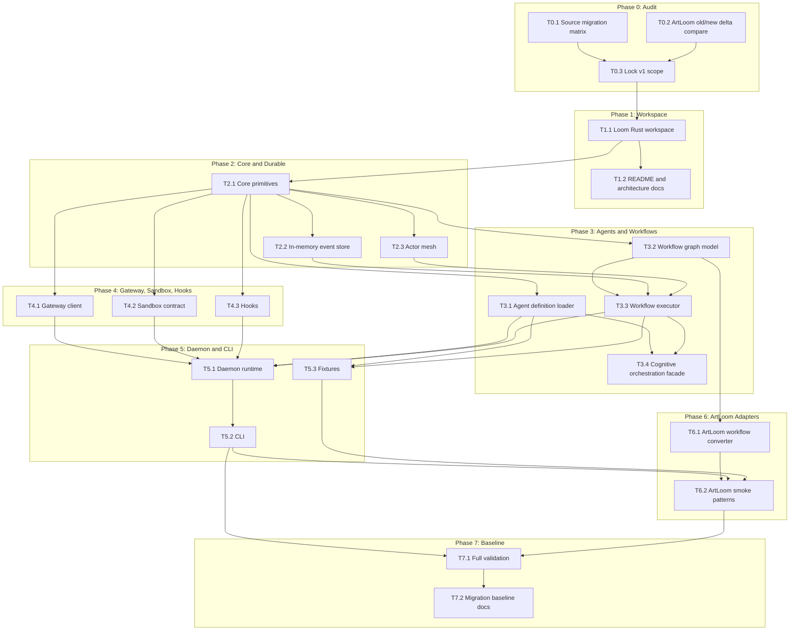

# Loom Dependency Graph

## Execution order

1. Finish Phase 0 audit before creating code.
2. Build workspace skeleton.
3. Implement core primitives before durable/agent/workflow modules.
4. Implement daemon only after agent, workflow, Gateway, sandbox, and hooks have
   testable contracts.
5. Add ArtLoom converters only after native Loom workflow contracts are stable.
6. Run full validation before declaring a Loom baseline.
